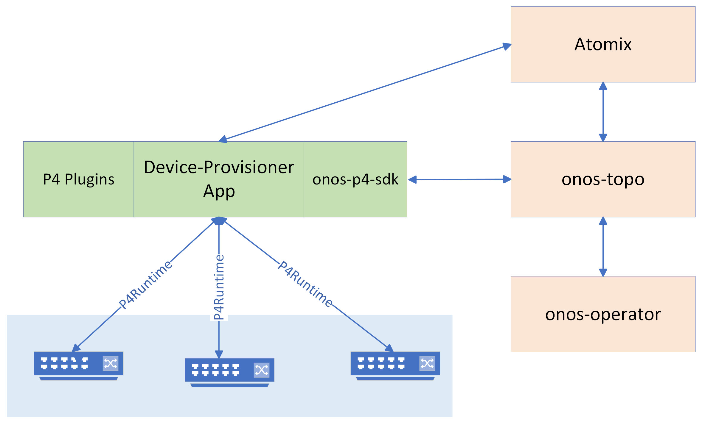

<!--
SPDX-FileCopyrightText: 2022 Intel Corporation

SPDX-License-Identifier: Apache-2.0
-->


# Device-provisioner
The main objective of this project is to implement an SDN application for provisioning of 
device pipeline config using P4Runtime and gNMI automatically when the devices in a network are discovered/provisioned using 
[onos-topo] subsystem. 


## Architecture
The application uses [onos-p4-sdk][onos-p4-sdk], [Atomix][Atomix], and [onos-p4-plugins][onos-p4-plugins] to 
implement a reconciliation loop controller that
brings the actual state device pipeline config to a desired state for each device that is defined as a programmable entity 
in [onos-topo][onos-topo]. The following figure show the interaction of the app with micro-onos subsystems. 




### Device Pipeline Configuration Using P4Runtime API
The application uses P4Runtime **SetForwardingPipelineConfig** RPC to set/update pipelines in a P4 programmable device. At very high level, the user specifies
the pipelines and type of configuration action that are defined in P4Runtime API (e.g.  VERIFY, VERIFY_AND_COMMIT, RECONCILE_AND_COMMIT, etc)
that should be provisioned for each device when the device entity is created in [onos-topo][onos-topo]. The pipeline config 
reconciliation loop controller listens to topology changes and tries to reconcile the pipeline config and reach to the desired state
based on the user request.
The application also uses Atomix primitives (a map) for keeping the internal device pipeline config state per target.

### Usage of P4 Plugins 
Device provisioner uses [onos-p4-plugins][onos-p4-plugins] to implement a P4 program agnostic device pipeline 
provisioning mechanism. Each P4 plugin provides an interface that allows to get access to the required information for 
provisioning a device pipeline such as P4Info and P4 device config. Device provisioner uses the information for each pipeline 
that user provides using onos-topo  (i.e. name, version, architecture of a P4 program) to
find appropriate P4 plugin using a plugin registry mechanism in the app. 

# Getting Started 
## Deployment 

**Prerequisites**: a Running kubernetes cluster, kubectl and helm installed. 

To deploy the app and all required subsystems, the following steps should be followed:

1) First we should add required helm repos and deploy Atomix controllers and onos operators 
that are required for deploying micro-onos subsystems and the application

```bash
helm repo add atomix https://charts.atomix.io
helm repo add onos https://charts.onosproject.org
helm repo update

helm install atomix-controller atomix/atomix-controller -n kube-system --wait
helm install atomix-raft-storage atomix/atomix-raft-storage -n kube-system  --wait
helm install -n kube-system atomix-runtime-controller atomix/atomix-runtime-controller --wait
helm install -n kube-system atomix-multi-raft-controller atomix/atomix-multi-raft-controller --set node.image.pullPolicy=Always --wait
helm install onos-operator onos/onos-operator -n kube-system --wait 

```

2) Use the following commands to deploy the device-provisioner app and required micro-onos components using onos umbrella chart

```bash
kubect create ns micro-onos
helm -n micro-onos install micro-onos  onos/onos-umbrella --set import.device-provisioner.enabled=true
```

if you deploy all of required subsystems successfully, you should be able to see the following pods using kubectl:

```bash
kubectl get pods -n micro-onos
NAME                                  READY   STATUS    RESTARTS   AGE
device-provisioner-59f4657b46-85n4z   2/2     Running   0          2m14s
device-provisioner-store-0            1/1     Running   0          2m14s
onos-cli-6d8b5b5d7d-s277n             1/1     Running   0          2m14s
onos-config-b54c89548-lfj58           6/6     Running   0          2m14s
onos-consensus-store-0                1/1     Running   0          2m14s
onos-topo-6c966588c8-qgnj7            3/3     Running   0          2m14s
```


> **Note**
> onos-cli can be used to verify the first interactions of the app with onos-topo subsystem.
> When the app deployment becomes ready, it creates a CONTROLLER entity 
> in onos-topo to represent itself as a control plan entity.


```bash
$ kubectl exec -it -n micro-onos deployments/onos-cli -- /bin/bash
$ onos topo get entities --kind controller
Entity ID                                  Kind ID      Labels   Aspects
p4rt:device-provisioner-59f4657b46-85n4z   controller   <None>   onos.topo.Lease,onos.topo.ControllerInfo
```

## How to Use/Test the device-provisioner application?
For testing purposes, developers can use [stratum-simulator][stratum-simulator] chart which deploys
[stratum mininet enabled docker image][stratum-image]. 

1) First, deploy the stratum-simulator chart using the following command:

```bash
helm install stratum-simulator  -n micro-onos onos/stratum-simulator
```

> **Note**
> stratum-simulator helm chart creates a linear topology with 2 switches by default. Each switch exposes a different gRPC port, 
> starting from 50001 and increasing.

2) Switch entities should be created to onos-topo that allows the application to make connection to the P4Runtime server
running on each device. To do so, onos-topo-operator which is deployed already will be used to create those entities in topo
To create two switch entities in topo:
 - Create the following yaml file (we name it topo.yaml)
 - Apply it in the namespace where the app deployed using kubectl or helm.

```yaml
apiVersion: topo.onosproject.org/v1beta1
kind: Entity
metadata:
  name: p4rt.s1
spec:
  uri: p4rt:s1 # protocol:switch_id
  kind:
    name: switch
  aspects:
    onos.topo.Switch:
      model_id: "test"
      role: "role-test"
    onos.topo.P4RTServerInfo:
      control_endpoint:
        address: stratum-simulator
        port: 50001
      device_id: 1
      pipelines:
        - name: "middleblock"
          version: "1.0.0"
          architecture: "v1model"
    onos.topo.TLSOptions:
      plain: true
      insecure: true
---
apiVersion: topo.onosproject.org/v1beta1
kind: Entity
metadata:
  name: p4rt.s2
spec:
  uri: p4rt:s2 # protocol:switch_id
  kind:
    name: switch
  aspects:
    onos.topo.Switch:
      model_id: "test"
      role: "role-test"
    onos.topo.P4RTServerInfo:
      control_endpoint:
        address: stratum-simulator
        port: 50002
      device_id: 1
      pipelines:
        - name: "middleblock"
          version: "1.0.0"
          architecture: "v1model"
    onos.topo.TLSOptions:
      plain: true
      insecure: true

```


```bash
$ kubectl apply -f topo.yaml -n micro-onos
entity.topo.onosproject.org/p4rt.s1 created
entity.topo.onosproject.org/p4rt.s2 created
```

when the entities created, you can check new entities and control relations between the app and each of the switches. 

To see the new switch entities, use onos-cli and run the following command:

```bash
$ onos topo get entities
Entity ID                                  Kind ID       Labels   Aspects
p4rt:s2                                    switch        <None>   onos.topo.P4RTServerInfo,onos.topo.TLSOptions,onos.topo.Switch,onos.topo.P4RTMastershipState,onos.topo.MastershipState
gnmi:onos-config-b54c89548-tdsbd           onos-config   <None>   onos.topo.Lease
p4rt:device-provisioner-59f4657b46-pk52z   controller    <None>   onos.topo.ControllerInfo,onos.topo.Lease
p4rt:s1                                    switch        <None>   onos.topo.TLSOptions,onos.topo.P4RTServerInfo,onos.topo.P4RTMastershipState,onos.topo.Switch
````

To see the new relations that are created by the app, run the following command.
```bash
$ onos topo get relations
Relation ID                                 Kind ID    Source ID                                  Target ID   Labels   Aspects
uuid:016f758a-069a-4ab3-ae85-c1d900341791   controls   p4rt:device-provisioner-59f4657b46-pk52z   p4rt:s1     <None>   <None>
uuid:29477dca-1d27-4777-baca-cde36918b843   controls   p4rt:device-provisioner-59f4657b46-pk52z   p4rt:s2     <None>   <None>
```

> **Note**: 
> Each CONTROL relation represents a connection from 
> the app (source ID is the ID of controller entity which represents the app) 
> to a switch (target ID is the switch entity ID). 

To verify the devices are configured successfully, you can check device-provisioner app logs. We are planning to provide
CLI that you can check the state of pipeline config per target. 
Here is the sample output in the logs

```bash
kubectl logs -n micro-onos deployments/device-provisioner device-provisioner --follow | grep "Device pipelineConfig is completed successfully"
2022-08-17T19:43:54.503Z	INFO	github.com/onosproject/device-provisioner/pkg/controller/pipeline	pipeline/controller.go:293	Device pipelineConfig is completed successfully	{"pipelineConfig ID": "p4rt:s2-middleblock-1.0.0-v1model", "targetID": "p4rt:s2"}
2022-08-17T19:43:54.739Z	INFO	github.com/onosproject/device-provisioner/pkg/controller/pipeline	pipeline/controller.go:293	Device pipelineConfig is completed successfully	{"pipelineConfig ID": "p4rt:s1-middleblock-1.0.0-v1model", "targetID": "p4rt:s1"}
```


[onos-p4-sdk]: https://github.com/onosproject/onos-p4-sdk
[Atomix]: https://github.com/atomix
[P4Runtime]: https://p4.org/p4-spec/p4runtime/main/P4Runtime-Spec.html
[onos-topo]: https://github.com/onosproject/onos-topo
[onos-p4-plugins]: https://github.com/onosproject/onos-p4-plugins
[helm]: https://helm.sh/
[stratum-simulator]: https://github.com/onosproject/onos-helm-charts/tree/master/stratum-simulator
[stratum-image]: https://hub.docker.com/r/opennetworking/mn-stratum