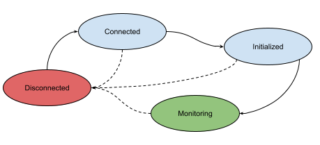

<!--
SPDX-FileCopyrightText: 2022 Intel Corporation

SPDX-License-Identifier: Apache-2.0
-->

# device-provisioner

This µONOS platform component is responsible for:

1) maintaining an inventory of pipeline and chassis configurations and
2) for applying these configurations to the network devices using P4Runtime and gNMI, respectively.

## Configurations API and Store

The component offers a gRPC API through which clients can manage the inventory of configurations.
Each configuration has a unique name, kind (e.g. `pipeline`, `chassis`) and an accompanying set of binary artifacts.

* Pipeline configurations are expected to have two artifacts:
    1) `p4info` - proto text of the P4Info structure
    2) `p4bin`- architecture-specific binary
* Chassis configuration has only one artifact:
    1) `chassis`- proto text to be applied to the root path

The configuration records are tracked using an Atomix distributed map primitive,
while the binaries for the configuration artifacts are stored on a shared persistent volume.

## Reconciler

In addition to providing a management gRPC API, the provisioner also runs a configuration reconciliation controller,
which is responsible for applying the configurations to the devices. Its operation is driven
by `onos.provisioner.DeviceConfig` aspect, which is expected to be attached to topology
entities representing the devices that are to be configured.

```protobuf
// DeviceConfig is a topology entity aspect used to specify what pipeline and chassis 
// config a device should have applied to it
message DeviceConfig {
  string pipeline_config_id = 1 [(gogoproto.customname) = "PipelineConfigID", (gogoproto.casttype) = "ConfigID"];
  string chassis_config_id = 2 [(gogoproto.customname) = "ChassisConfigID", (gogoproto.casttype) = "ConfigID"];
}
```

The state of the reconciliation for each device is then in turn maintained using
`onos.provisioner.PipelineConfigState` and `onos.provisioner.ChassisConfigState` aspects,
which record the result of the last successful device configuration.

```protobuf
// PipelineConfigState is a topology entity aspect used to indicate what pipeline config
// a device has presently applied to it
message PipelineConfigState {
  string config_id = 1 [(gogoproto.customname) = "ConfigID", (gogoproto.casttype) = "ConfigID"];
  uint64 cookie = 2;
  google.protobuf.Timestamp updated = 3 [(gogoproto.stdtime) = true, (gogoproto.nullable) = false];
}

// ChassisConfigState is a topology entity aspect used to indicate what chassis config
// a device has presently applied to it
message ChassisConfigState {
  string config_id = 1 [(gogoproto.customname) = "ConfigID", (gogoproto.casttype) = "ConfigID"];
  google.protobuf.Timestamp updated = 2 [(gogoproto.stdtime) = true, (gogoproto.nullable) = false];
}
```

Lastly, the southbound code of the reconciler relies on `onos.topo.P4RuntimeServer` aspect to obtain
P4Runtime endpoint information for establishing its connection to the Stratum device.

## Realms

Multiple instances of the provisioner can be run and cooperate using the same configurations
Atomix store and persistent volume, while dividing their responsibilities for applying those
configurations to mutually distinct sets of devices. Such partitioning is achieved by applying
a realm label with a particular realm label value to each device entity to "assign it" to a
particular realm.

Each instance of the provisioner then needs to be started with the same `--realm-label` (e.g. `pod`),
and a unique `--realm-value` (e.g. `pod-07`). The reconciler will only concern itself with configuring devices whose
topology entities have
that label/value combination using label-based query.

## Deployment
_Update the provisioner helm chart with proper persistent volume configuration before updating this 
section..._


## CLI

CLI for the provisioner is integrated into the µONOS main CLI and allows
management of the intentory of pipeline and chassis configurations.

```shell
$ onos provisioner
Device provisioner subsystem commands

Usage:
  onos provisioner [command]

Aliases:
  provisioner, device-provisioner

Available Commands:
  add         Add new device configuration
  config      Manage the CLI configuration
  delete      Delete device configuration
  get         Get device configurations
  log         logging api commands

Flags:
      --auth-header string       Auth header in the form 'Bearer <base64>'
  -h, --help                     help for provisioner
      --no-tls                   if present, do not use TLS
      --service-address string   the gRPC endpoint (default "device-provisioner:5150")
      --tls-cert-path string     the path to the TLS certificate
      --tls-key-path string      the path to the TLS key

Use "onos provisioner [command] --help" for more information about a command.
```

## Operation

The NB API and the configuration stores are passive entities, driven
entirely by the interactions with the API.

The configuration reconciliation controller is an active component,
whose action is primarily driven by changes to the entities in the `onos-topo`
subsystem and will use the even to trigger configuration reconciliation on
the effected entity.



On startup, the provisioner will attempt to establish connection to `onos-topo` subsystem.
Once connected, it will start monitoring the topology entities in its realm for changes.
In addition to being triggered by changes, the controller will also periodically perform
configuration reconciliation on all entities in the realm, starting with an initial comprehensive
sweep immediatelly after obtaining the connection to the `onos-topo` subsystem.

All reconcilliation activities are routed to a bank of reconciler workers, allowing the
controller to configure multiple devices at the same time.

The reconciler first checks if the expected configuration specified in the
`onos.provisioner.DeviceConfig` aspect matches the currently applied configuration
recorded in `onos.provisioner.PipelineConfigState` or `onos.provisioner.ChassisConfigState` aspects.
If a mismatch is found, the reconciler will apply the configuration to the device using the
appropriate SB protocol (P4Runtime for pipeline and gNMI for chassis config), recording the
change in the appropriate state aspect after the completion of the SB operation.


[Atomix]: https://github.com/atomix

[P4Runtime]: https://p4.org/p4-spec/p4runtime/main/P4Runtime-Spec.html

[onos-topo]: https://github.com/onosproject/onos-topo

[onos-p4-plugins]: https://github.com/onosproject/onos-p4-plugins

[helm]: https://helm.sh/

[stratum-simulator]: https://github.com/onosproject/onos-helm-charts/tree/master/stratum-simulator

[stratum-image]: https://hub.docker.com/r/opennetworking/mn-stratum

[gNMI]: https://github.com/openconfig/reference/blob/master/rpc/gnmi/gnmi-specification.md

[onos-p4-sdk]: https://github.com/onosproject/onos-p4-sdk
